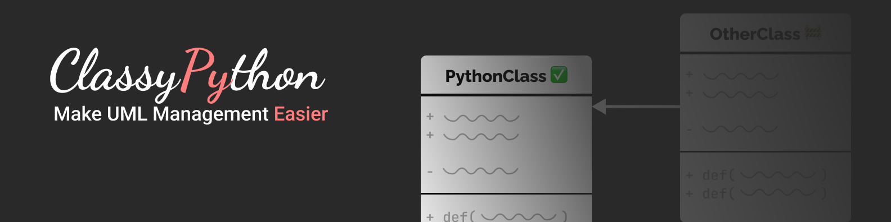

<h1 align='center'>
    ClassyPython: Make UML Management Easier
</h1>

<p align="center">
    Contrubitors:
  <a href="https://github.com/GuilhermeCosta-Ferreira">Guilherme Costa Ferreira</a>
</p>

<div align="center">
    
    
    
    
    
</div>

---

**Keep a PlantUML class diagram in sync with your code.**

You sketch your intended architecture once in a `.puml` class diagram — every class
starts out "planned". As you build, `classpy` inspects your source tree and repaints
each class by how far along it is: planned → partial → implemented. The diagram
becomes a living status board of your project instead of a drawing that rots.

| Stereotype        | Colour | Meaning                                                        |
| ----------------- | ------ | -------------------------------------------------------------- |
| `<<planned>>`     | pink   | no matching class found in code                                |
| `<<partial>>`     | yellow | class exists, but not all declared members are present yet     |
| `<<implemented>>` | green  | class exists with every declared attribute/method present      |
| `<<external>>`    | blue   | external dependency — **never touched** by the tool            |

---

## Mental model: it's a dev tool, not a runtime dependency

`classpy` is a **command-line tool you run *against* a project** (like `black`,
`pytest`, or `mypy`). You do **not** `import classpy` from your application code.

To use it in another Python project you:

1. **Install** the `classpy` command into an environment.
2. Add a **`.puml` class diagram** describing that project's architecture.
3. Run **`classpy status`** (report) or **`classpy sync`** (repaint the diagram).

There is also a small [programmatic API](#programmatic-api) if you want to embed the
analysis in your own tooling — but the normal path is the CLI.

---

## Installation

`classpy` is not published to PyPI, so install it straight from this repository.

### Into another project with Poetry

```bash
# in the OTHER project's directory
poetry add --group dev git+https://github.com/GuilhermeCF/ClassyPython.git
```

### With pip (from a git URL)

```bash
pip install "git+https://github.com/GuilhermeCF/ClassyPython.git"
```

### With pipx (install once, use everywhere — recommended for a pure CLI)

```bash
pipx install "git+https://github.com/GuilhermeCF/ClassyPython.git"
```

### From a local checkout / build

```bash
git clone https://github.com/GuilhermeCF/ClassyPython.git
cd ClassyPython
poetry build            # produces dist/classpy-0.1.0-py3-none-any.whl
# then, in your other project:
pip install /path/to/ClassyPython/dist/classpy-0.1.0-py3-none-any.whl
```

Any of these put a `classpy` executable on your PATH. Requires **Python 3.11–3.14**.

> Rendering the diagram to a PNG additionally needs [PlantUML](https://plantuml.com/)
> (a `plantuml` binary + Java). `classpy` itself only reads and rewrites the `.puml`
> text — it never renders — so PlantUML is only needed when you want an image.

---

## Using it in another project

### 1. Describe your architecture in a `.puml` file

Create `docs/class.puml`. Declare each class you intend to build, listing the
attributes and methods you expect it to have — those declared members are what
`classpy` matches against your code to decide "partial" vs "implemented". Start

```plantuml
@startuml
skinparam class {
    BackgroundColor<<implemented>> #D5F5D5
    BackgroundColor<<partial>>     #FFF3CD
    BackgroundColor<<planned>>     #F8D7DA
    BackgroundColor<<external>>    #E3F2FD
}

package "Service Layer" {
    class OrderService <<planned>> {
        + place_order(cart)
        + cancel_order(id)
    }
}
@enduml
```

everything as `<<planned>>`; mark third-party classes `<<external>>`.



Class names map to files by `PascalCase` → `snake_case` convention
(`OrderService` → `order_service.py`); the package hierarchy disambiguates when
several classes share a name.

### 2. Check status (read-only)

```bash
classpy status --puml docs/class.puml --src src
```

```
   [plan] OrderService
 * [part] PaymentGateway
   [impl] Cart

impl=1  part=1  plan=1  ext=0
1 class(es) out of date.
```

`--puml` defaults to `docs/class.puml` and `--src` defaults to `src`, so from a
project laid out that way you can just run `classpy status`.

### 3. Sync (repaint the diagram in place)

```bash
classpy sync --puml docs/class.puml --src src
```

This rewrites the stereotypes in `docs/class.puml` so each class's colour matches
reality. It only touches stereotypes — your layout, notes, and links are preserved.
Regenerate the image afterward with PlantUML if you want a PNG:

```bash
plantuml -tpng docs/class.puml
```

### 4. Plan what to build next

`classpy todo` lists the classes that aren't implemented yet, sorted **least-
dependent first** — a ready-to-follow build order where every class appears
after the (still-unbuilt) classes it depends on:

```bash
classpy todo --puml docs/class.puml --src src
```

```
Build order (least-dependent first):

 1. [plan] Parser
 2. [plan] Writer
 3. [plan] Service  (needs Parser, Writer)
 4. [plan] Cli  (needs Service)

4 class(es) to implement.
```

By default only `planned` (not-yet-started) classes are listed. Add `--partial`
to also include partially-implemented classes. Dependencies on classes that are
*already implemented* are treated as done — they never hold a class back or show
up in the `needs …` hint.

### 5. Enforce it in CI

`--check` computes status, writes nothing, and exits non-zero if the diagram is
stale — so a pull request fails when someone forgets to resync:

```bash
classpy sync --check --puml docs/class.puml --src src
```

---

## Command reference

| Command                 | What it does                                                        |
| ----------------------- | ------------------------------------------------------------------- |
| `classpy status`        | Report each class's status. Never writes.                           |
| `classpy sync`          | Repaint the `.puml` stereotypes to match the code.                  |
| `classpy sync --check`  | Report + exit non-zero if stale (writes nothing). For CI.           |
| `classpy todo`          | List unimplemented classes in build order (least-dependent first).  |
| `classpy todo --partial`| Same, but also include partially-implemented classes.               |

Shared options: `--puml PATH`, `--src PATH`. Resolution order for each is
**CLI flag → `[tool.classpy]` in `pyproject.toml` → built-in default**
(`docs/class.puml` / `src`).

---

## Per-project defaults (`pyproject.toml`)

If your project doesn't use the `docs/class.puml` + `src` layout, set its defaults
once in `pyproject.toml` instead of passing `--puml`/`--src` every time:

```toml
[tool.classpy]
puml = "docs/architecture.puml"
src  = "app"
```

`classpy` searches upward from the current directory for the nearest
`pyproject.toml`. With the above, a bare `classpy status` / `classpy sync` uses
those paths. An explicit `--puml` or `--src` on the command line still overrides
the config, and if a key is omitted the built-in default applies.

---

## Programmatic API

If you want to embed the analysis (a dashboard, a custom report, a git hook) rather
than call the CLI, use `SyncService` directly:

```python
from classpy.services.sync_service import SyncService
from classpy.domain.models import ImplementationStatus

service = SyncService()

# Read-only: compute status without touching the file
report = service.status("docs/class.puml", "src")

for comparison in report.comparisons:
    print(comparison.uml_class.name, "->", comparison.status.value)
    for member in comparison.missing_members:
        print("   missing:", member.name)

print(report.counts[ImplementationStatus.IMPLEMENTED], "classes implemented")
print("stale?", report.is_stale)

# Write the repainted diagram back to disk
service.sync("docs/class.puml", "src")
```

`SyncService` wires together five swappable pieces, each usable on its own:

- `PumlParser` — `.puml` text → `list[UmlClass]`
- `CodeInspector` — `ast` scan of a source tree → `list[CodeClass]`
- `ClassLocator` — match a UML class to the code class that implements it
- `StatusComparator` — `(UmlClass, CodeClass | None)` → `ClassComparison`
- `PumlWriter` — rewrite stereotypes in the `.puml` text

Pass your own implementations into `SyncService(parser=…, inspector=…, …)` to
customize behaviour.

---

## How status is decided

For each class declared in the diagram:

1. **`external`** classes are left exactly as-is.
2. Find the code class by name + `PascalCase`→`snake_case` filename, scoped by the
   UML package hierarchy.
3. No code class found → **`planned`**.
4. Code class found, but some declared members missing → **`partial`**.
5. Code class found with every declared member present → **`implemented`**.

A class that declares **no** members can only be `planned` (absent) or
`implemented` (present) — never `partial`.

---

## Development

This repo dogfoods itself: [`docs/class.puml`](docs/class.puml) describes `classpy`'s
own architecture, and `classpy sync` runs against this codebase.

```bash
poetry install          # set up the environment
poetry run pytest       # run the test suite
make diagram            # render docs/class.puml -> docs/class.png (needs PlantUML)
```

Architecture is a strict three layers — `domain/` (pure logic, no I/O),
`adapters/` (I/O + external libs), `services/` (orchestration). See
[`.claude/tool_design.md`](.claude/tool_design.md) and
[`.claude/uml_style.md`](.claude/uml_style.md) for the full design notes and
diagram conventions.
